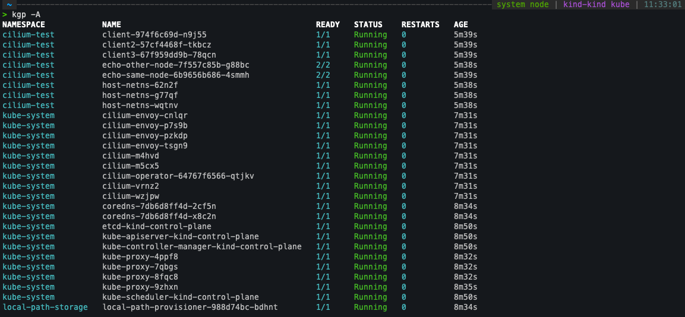

# Cilium on kind

Cilium is open source software for transparently securing the network connectivity between application services deployed using Linux container management platforms like Docker and Kubernetes.

At the foundation of Cilium is a new Linux kernel technology called eBPF, which enables the dynamic insertion of powerful security visibility and control logic within Linux itself. Because eBPF runs inside the Linux kernel, Cilium security policies can be applied and updated without any changes to the application code or container configuration.

## Pre-reqs (cluster setup etc)

```bash

## make sure Docker Desktop & kind are installed on your machine

kind create cluster --config=kind-config.yaml
```

## Setup

```bash
cilium version --client ## check cilum is installed

cilium install --version 1.16.1

cilium status ## check cilium is installed. The daemonsets should spin up 4 pods running cilium

kubectl get nodes -A ## nodes should be ready as now we have a CNI

```

## Run cilium connectivity tests



```bash

> cilium connectivity test
ℹ️  Monitor aggregation detected, will skip some flow validation steps
✨ [kind-kind] Creating namespace cilium-test for connectivity check...
✨ [kind-kind] Deploying echo-same-node service...
✨ [kind-kind] Deploying DNS test server configmap...
✨ [kind-kind] Deploying same-node deployment...
✨ [kind-kind] Deploying client deployment...
✨ [kind-kind] Deploying client2 deployment...
✨ [kind-kind] Deploying client3 deployment...
✨ [kind-kind] Deploying echo-other-node service...
✨ [kind-kind] Deploying other-node deployment...
✨ [host-netns] Deploying kind-kind daemonset...
✨ [host-netns-non-cilium] Deploying kind-kind daemonset...
ℹ️  Skipping tests that require a node Without Cilium
⌛ [kind-kind] Waiting for deployment cilium-test/client to become ready...
⌛ [kind-kind] Waiting for deployment cilium-test/client2 to become ready...
⌛ [kind-kind] Waiting for deployment cilium-test/echo-same-node to become ready...
⌛ [kind-kind] Waiting for deployment cilium-test/client3 to become ready...
⌛ [kind-kind] Waiting for deployment cilium-test/echo-other-node to become ready...
⌛ [kind-kind] Waiting for pod cilium-test/client-974f6c69d-n9j55 to reach DNS server on cilium-test/echo-same-node-6b9656b686-4smmh pod...
⌛ [kind-kind] Waiting for pod cilium-test/client2-57cf4468f-tkbcz to reach DNS server on cilium-test/echo-same-node-6b9656b686-4smmh pod...
⌛ [kind-kind] Waiting for pod cilium-test/client3-67f959dd9b-78qcn to reach DNS server on cilium-test/echo-same-node-6b9656b686-4smmh pod...
⌛ [kind-kind] Waiting for pod cilium-test/client2-57cf4468f-tkbcz to reach DNS server on cilium-test/echo-other-node-7f557c85b-g88bc pod...
⌛ [kind-kind] Waiting for pod cilium-test/client3-67f959dd9b-78qcn to reach DNS server on cilium-test/echo-other-node-7f557c85b-g88bc pod...
⌛ [kind-kind] Waiting for pod cilium-test/client-974f6c69d-n9j55 to reach DNS server on cilium-test/echo-other-node-7f557c85b-g88bc pod...
⌛ [kind-kind] Waiting for pod cilium-test/client-974f6c69d-n9j55 to reach default/kubernetes service...
⌛ [kind-kind] Waiting for pod cilium-test/client2-57cf4468f-tkbcz to reach default/kubernetes service...
⌛ [kind-kind] Waiting for pod cilium-test/client3-67f959dd9b-78qcn to reach default/kubernetes service...
⌛ [kind-kind] Waiting for Service cilium-test/echo-other-node to become ready...
⌛ [kind-kind] Waiting for Service cilium-test/echo-other-node to be synchronized by Cilium pod kube-system/cilium-vrnz2
⌛ [kind-kind] Waiting for Service cilium-test/echo-other-node to be synchronized by Cilium pod kube-system/cilium-wzjpw
⌛ [kind-kind] Waiting for Service cilium-test/echo-same-node to become ready...
⌛ [kind-kind] Waiting for Service cilium-test/echo-same-node to be synchronized by Cilium pod kube-system/cilium-vrnz2
⌛ [kind-kind] Waiting for Service cilium-test/echo-same-node to be synchronized by Cilium pod kube-system/cilium-wzjpw
⌛ [kind-kind] Waiting for NodePort 172.18.0.4:30576 (cilium-test/echo-other-node) to become ready...
⌛ [kind-kind] Waiting for NodePort 172.18.0.4:31435 (cilium-test/echo-same-node) to become ready...
⌛ [kind-kind] Waiting for NodePort 172.18.0.3:31435 (cilium-test/echo-same-node) to become ready...
⌛ [kind-kind] Waiting for NodePort 172.18.0.3:30576 (cilium-test/echo-other-node) to become ready...
⌛ [kind-kind] Waiting for NodePort 172.18.0.2:30576 (cilium-test/echo-other-node) to become ready...
⌛ [kind-kind] Waiting for NodePort 172.18.0.2:31435 (cilium-test/echo-same-node) to become ready...
⌛ [kind-kind] Waiting for NodePort 172.18.0.5:30576 (cilium-test/echo-other-node) to become ready...
⌛ [kind-kind] Waiting for NodePort 172.18.0.5:31435 (cilium-test/echo-same-node) to become ready...
⌛ [kind-kind] Waiting for DaemonSet cilium-test/host-netns-non-cilium to become ready...
⌛ [kind-kind] Waiting for DaemonSet cilium-test/host-netns to become ready...
ℹ️  Skipping IPCache check
🔭 Enabling Hubble telescope...
⚠️  Unable to contact Hubble Relay, disabling Hubble telescope and flow validation: rpc error: code = Unavailable desc = connection error: desc = "transport: Error while dialing: dial tcp [::1]:4245: connect: connection refused"
ℹ️  Expose Relay locally with:
   cilium hubble enable
   cilium hubble port-forward&
ℹ️  Cilium version: 1.16.1
🏃[cilium-test] Running 100 tests ...
[=] [cilium-test] Test [no-unexpected-packet-drops] [1/100]
....
[=] [cilium-test] Test [no-policies] [2/100]
...................................................
[=] [cilium-test] Skipping test [no-policies-from-outside] [3/100] (skipped by condition)
[=] [cilium-test] Test [no-policies-extra] [4/100]
........................
[=] [cilium-test] Test [allow-all-except-world] [5/100]
..............................
[=] [cilium-test] Test [client-ingress] [6/100]
......
[=] [cilium-test] Test [client-ingress-knp] [7/100]
......
[=] [cilium-test] Test [allow-all-with-metrics-check] [8/100]
......
[=] [cilium-test] Test [all-ingress-deny] [9/100]
............
[=] [cilium-test] Skipping test [all-ingress-deny-from-outside] [10/100] (skipped by condition)
[=] [cilium-test] Test [all-ingress-deny-knp] [11/100]
............
[=] [cilium-test] Test [all-egress-deny] [12/100]
........................
[=] [cilium-test] Test [all-egress-deny-knp] [13/100]
........................
[=] [cilium-test] Test [all-entities-deny] [14/100]
............
[=] [cilium-test] Test [cluster-entity] [15/100]
...
[=] [cilium-test] Skipping test [cluster-entity-multi-cluster] [16/100] (skipped by condition)
[=] [cilium-test] Test [host-entity-egress] [17/100]
............
[=] [cilium-test] Test [host-entity-ingress] [18/100]
......
[=] [cilium-test] Test [echo-ingress] [19/100]
......
[=] [cilium-test] Skipping test [echo-ingress-from-outside] [20/100] (skipped by condition)
[=] [cilium-test] Test [echo-ingress-knp] [21/100]
......
[=] [cilium-test] Test [client-ingress-icmp] [22/100]
......
[=] [cilium-test] Test [client-egress] [23/100]
......
[=] [cilium-test] Test [client-egress-knp] [24/100]
......
[=] [cilium-test] Test [client-egress-expression] [25/100]
......
[=] [cilium-test] Test [client-egress-expression-port-range] [26/100]
......
[=] [cilium-test] Test [client-egress-expression-knp] [27/100]
......
[=] [cilium-test] Test [client-egress-expression-knp-port-range] [28/100]
......
[=] [cilium-test] Test [client-with-service-account-egress-to-echo] [29/100]
......
[=] [cilium-test] Test [client-with-service-account-egress-to-echo-port-range] [30/100]
......
[=] [cilium-test] Test [client-egress-to-echo-service-account] [31/100]
......
[=] [cilium-test] Test [client-egress-to-echo-service-account-port-range] [32/100]
......
[=] [cilium-test] Test [to-entities-world] [33/100]
.........
[=] [cilium-test] Test [to-entities-world-port-range] [34/100]
.........
[=] [cilium-test] Test [to-cidr-external] [35/100]
......
[=] [cilium-test] Test [to-cidr-external-knp] [36/100]
......
[=] [cilium-test] Skipping test [from-cidr-host-netns] [37/100] (skipped by condition)
[=] [cilium-test] Test [echo-ingress-from-other-client-deny] [38/100]
..........
[=] [cilium-test] Test [client-ingress-from-other-client-icmp-deny] [39/100]
............
[=] [cilium-test] Test [client-egress-to-echo-deny] [40/100]
............
[=] [cilium-test] Test [client-egress-to-echo-deny-port-range] [41/100]
............
[=] [cilium-test] Test [client-ingress-to-echo-named-port-deny] [42/100]
....
[=] [cilium-test] Test [client-egress-to-echo-expression-deny] [43/100]
....
[=] [cilium-test] Test [client-egress-to-echo-expression-deny-port-range] [44/100]
....
[=] [cilium-test] Test [client-with-service-account-egress-to-echo-deny] [45/100]
....
[=] [cilium-test] Test [client-with-service-account-egress-to-echo-deny-port-range] [46/100]
....
[=] [cilium-test] Test [client-egress-to-echo-service-account-deny] [47/100]
..
[=] [cilium-test] Test [client-egress-to-echo-service-account-deny-port-range] [48/100]
..
[=] [cilium-test] Test [client-egress-to-cidr-deny] [49/100]
......
[=] [cilium-test] Test [client-egress-to-cidr-deny-default] [50/100]
......
[=] [cilium-test] Skipping test [clustermesh-endpointslice-sync] [51/100] (skipped by condition)
[=] [cilium-test] Test [health] [52/100]
....
[=] [cilium-test] Skipping test [north-south-loadbalancing] [53/100] (Feature node-without-cilium is disabled)
[=] [cilium-test] Test [pod-to-pod-encryption] [54/100]
.
[=] [cilium-test] Skipping test [pod-to-pod-with-l7-policy-encryption] [55/100] (requires Feature encryption-pod mode wireguard, got disabled)
[=] [cilium-test] Test [node-to-node-encryption] [56/100]
...
[=] [cilium-test] Skipping test [egress-gateway] [57/100] (skipped by condition)
[=] [cilium-test] Skipping test [egress-gateway-with-l7-policy] [59/100] (skipped by condition)
[=] [cilium-test] Skipping test [egress-gateway-excluded-cidrs] [58/100] (Feature enable-ipv4-egress-gateway is disabled)
[=] [cilium-test] Skipping test [pod-to-node-cidrpolicy] [60/100] (Feature cidr-match-nodes is disabled)
[=] [cilium-test] Skipping test [north-south-loadbalancing-with-l7-policy] [61/100] (Feature node-without-cilium is disabled)
[=] [cilium-test] Skipping test [north-south-loadbalancing-with-l7-policy-port-range] [62/100] (Feature node-without-cilium is disabled)
[=] [cilium-test] Test [echo-ingress-l7] [63/100]
..................
[=] [cilium-test] Test [echo-ingress-l7-named-port] [64/100]
..................
[=] [cilium-test] Test [client-egress-l7-method] [65/100]
..................
[=] [cilium-test] Test [client-egress-l7-method-port-range] [66/100]
..................
[=] [cilium-test] Test [client-egress-l7] [67/100]
...............
[=] [cilium-test] Test [client-egress-l7-port-range] [68/100]
...............
[=] [cilium-test] Test [client-egress-l7-named-port] [69/100]
...............
[=] [cilium-test] Skipping test [client-egress-l7-tls-deny-without-headers] [70/100] (Feature secret-backend-k8s is disabled)
[=] [cilium-test] Skipping test [client-egress-l7-tls-headers-port-range] [72/100] (Feature secret-backend-k8s is disabled)
[=] [cilium-test] Skipping test [client-egress-l7-tls-headers] [71/100] (Feature secret-backend-k8s is disabled)
[=] [cilium-test] Skipping test [client-egress-l7-set-header] [73/100] (Feature secret-backend-k8s is disabled)
[=] [cilium-test] Skipping test [client-egress-l7-set-header-port-range] [74/100] (Feature secret-backend-k8s is disabled)
[=] [cilium-test] Skipping test [echo-ingress-auth-always-fail] [75/100] (Feature mutual-auth-spiffe is disabled)
[=] [cilium-test] Skipping test [echo-ingress-auth-always-fail-port-range] [76/100] (Feature mutual-auth-spiffe is disabled)
[=] [cilium-test] Skipping test [echo-ingress-mutual-auth-spiffe] [77/100] (Feature mutual-auth-spiffe is disabled)
[=] [cilium-test] Skipping test [echo-ingress-mutual-auth-spiffe-port-range] [78/100] (Feature mutual-auth-spiffe is disabled)
[=] [cilium-test] Skipping test [pod-to-ingress-service-deny-all] [80/100] (Feature ingress-controller is disabled)
[=] [cilium-test] Skipping test [pod-to-ingress-service] [79/100] (Feature ingress-controller is disabled)
[=] [cilium-test] Skipping test [pod-to-ingress-service-deny-ingress-identity] [81/100] (Feature ingress-controller is disabled)
[=] [cilium-test] Skipping test [pod-to-ingress-service-deny-backend-service] [82/100] (Feature ingress-controller is disabled)
[=] [cilium-test] Skipping test [pod-to-ingress-service-allow-ingress-identity] [83/100] (Feature ingress-controller is disabled)
[=] [cilium-test] Skipping test [outside-to-ingress-service] [84/100] (Feature ingress-controller is disabled)
[=] [cilium-test] Skipping test [outside-to-ingress-service-deny-world-identity] [85/100] (Feature ingress-controller is disabled)
[=] [cilium-test] Skipping test [outside-to-ingress-service-deny-cidr] [86/100] (Feature ingress-controller is disabled)
[=] [cilium-test] Skipping test [outside-to-ingress-service-deny-all-ingress] [87/100] (Feature ingress-controller is disabled)
[=] [cilium-test] Test [dns-only] [88/100]
...............
[=] [cilium-test] Test [to-fqdns] [89/100]
............
[=] [cilium-test] Skipping test [pod-to-controlplane-host] [90/100] (skipped by condition)
[=] [cilium-test] Skipping test [pod-to-k8s-on-controlplane] [91/100] (skipped by condition)
[=] [cilium-test] Skipping test [pod-to-controlplane-host-cidr] [92/100] (skipped by condition)
[=] [cilium-test] Skipping test [pod-to-k8s-on-controlplane-cidr] [93/100] (skipped by condition)
[=] [cilium-test] Skipping test [local-redirect-policy] [94/100] (Feature enable-local-redirect-policy is disabled)
[=] [cilium-test] Test [pod-to-pod-no-frag] [95/100]
.
[=] [cilium-test] Skipping test [bgp-control-plane-v1] [96/100] (skipped by condition)
[=] [cilium-test] Skipping test [bgp-control-plane-v2] [97/100] (skipped by condition)
[=] [cilium-test] Skipping test [host-firewall-ingress] [98/100] (skipped by condition)
[=] [cilium-test] Skipping test [host-firewall-egress] [99/100] (skipped by condition)
[=] [cilium-test] Test [check-log-errors] [100/100]
.................................
✅ [cilium-test] All 59 tests (608 actions) successful, 41 tests skipped, 1 scenarios skipped.

```
